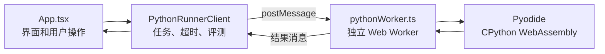

# Frontend Multilanguage Judge

这是一个基于 Vite、React、TypeScript、Monaco Editor 和 Pyodide 的纯前端评测平台。

当前版本已经完成 Python 的编译检查、运行、超时终止和本地测试点评测。C++ 入口目前仅保留在界面和类型层，尚未接入编译运行时。

## 1. 项目文件清单

### 1.1 核心业务代码

这些文件决定平台的功能，开发和交接时应重点阅读并保留。

| 文件 | 职责 |
| --- | --- |
| `src/App.tsx` | 主界面和交互流程，包括题目切换、代码编辑、编译、运行、评测、状态展示和 localStorage 持久化 |
| `src/types.ts` | 题目、测试点、编译结果、运行结果、评测结果和 Worker 消息的 TypeScript 类型 |
| `src/data/problems.ts` | 内置 Python 题库、样例、初始代码和测试数据 |
| `src/services/pythonRunner.ts` | 浏览器主线程中的 Python 调度器，负责创建 Worker、发送任务、控制 3000ms 超时和组织评测 |
| `src/workers/pythonWorker.ts` | Pyodide 执行环境，负责 Python 语法检查、编译、stdin/stdout/stderr 和异常捕获 |
| `src/styles.css` | 页面布局、组件样式和窄屏响应式规则 |

### 1.2 应用入口和项目配置

这些文件大多是 Vite/TypeScript 项目的常规配置。平时开发业务时可以少关注，但不要随意删除。

| 文件 | 是否应交付 | 说明 |
| --- | --- | --- |
| `src/main.tsx` | 是 | React 应用入口，把 `App` 挂载到页面 |
| `src/vite-env.d.ts` | 是 | Vite 提供的 TypeScript 环境类型声明，通常不用修改 |
| `index.html` | 是 | 浏览器 HTML 入口，包含页面标题、favicon 和 `#root` |
| `package.json` | 是 | 依赖、项目名称和 `dev/build/preview` 命令 |
| `pnpm-lock.yaml` | 是 | 锁定依赖的实际版本，保证不同电脑安装结果一致 |
| `.npmrc` | 是 | pnpm 安装配置，通常不用修改 |
| `vite.config.ts` | 是 | Vite 和 Web Worker 构建配置 |
| `tsconfig.json` | 是 | TypeScript 项目引用入口 |
| `tsconfig.app.json` | 是 | 浏览器端 React/TypeScript 编译配置 |
| `tsconfig.node.json` | 是 | `vite.config.ts` 的 TypeScript 配置 |

`pnpm-lock.yaml` 虽然由包管理器生成，但它不是垃圾文件，应和源码一起交付。

### 1.3 可以不交付或忽略的文件

以下内容不参与当前主应用的构建和运行：

| 文件或目录 | 处理建议 |
| --- | --- |
| `exercise/` | 已移出本项目；属于独立练习内容，不参与主应用构建 |
| `前端网页样例/` | 已移出本项目；属于独立 Pyodide 原型，不参与正式 React 应用构建 |
| `TempTestingText.cpp` | C++ 临时测试文件，正式接入前可忽略 |
| `Frontend Multilanguage Judge.lnk` | 打开当前项目目录的本机快捷方式，换电脑通常失效，不应交付 |
| `pyodide-0.29.4.tar.bz2` | 本地 Pyodide 压缩包，当前代码没有使用；运行时从 jsDelivr CDN 加载，可不交付 |
| `pyodide-0.29.4.tar.bz2:Zone.Identifier` 对应文件 | Windows 下载标记，不参与项目，应忽略 |
| `node_modules/` | 依赖安装目录，可由 `pnpm install` 重建，不应提交或打包 |
| `dist/` | `pnpm build` 生成的产物；交源码时不必包含，单独部署静态站点时才使用 |
| `*.tsbuildinfo` | TypeScript 构建缓存，可自动重建 |

建议交付的最小目录如下：

```text
项目根目录/
├─ src/
│  ├─ data/
│  ├─ services/
│  ├─ workers/
│  ├─ App.tsx
│  ├─ main.tsx
│  ├─ styles.css
│  ├─ types.ts
│  └─ vite-env.d.ts
├─ .npmrc
├─ index.html
├─ package.json
├─ pnpm-lock.yaml
├─ README.md
├─ tsconfig.app.json
├─ tsconfig.json
├─ tsconfig.node.json
└─ vite.config.ts
```

## 2. 启动方法

### 2.1 环境要求

- Node.js 20 LTS，或至少 Node.js 18
- pnpm 9
- 可访问互联网的现代浏览器

互联网连接是必需的，因为第一次编译或运行 Python 时，Worker 会从以下地址加载 Pyodide 0.29.4：

```text
https://cdn.jsdelivr.net/pyodide/v0.29.4/full/
```

### 2.2 首次启动

在终端进入项目根目录：

```bash
cd /home/zack/vscode/Programs/frontend-multilang-judge
```

检查环境：

```bash
node --version
pnpm --version
```

如果 Node 已安装但没有 pnpm，可执行：

```bash
corepack enable
corepack prepare pnpm@9 --activate
```

安装依赖并启动开发服务器：

```bash
pnpm install --frozen-lockfile
pnpm dev
```

浏览器访问：

```text
http://localhost:5173/
```

不要直接双击 `index.html`。Vite 模块、Monaco Editor 和 Web Worker 需要通过 HTTP 开发服务器或静态服务器加载。

### 2.3 日常启动

依赖已经安装后，只需要：

```bash
pnpm dev
```

如果 5173 端口被占用：

```bash
pnpm dev -- --port 5174
```

然后访问 `http://localhost:5174/`。

### 2.4 构建和预览生产版本

```bash
pnpm build
pnpm preview
```

- `pnpm build` 会先执行 TypeScript 检查，再生成 `dist/`。
- `pnpm preview` 用本地服务器预览 `dist/`。
- `dist/` 可以部署到 Nginx、GitHub Pages、Vercel、Netlify 或普通静态文件服务器。
- 部署后仍需允许浏览器访问 Pyodide CDN。

## 3. 当前 Python 架构



执行流程：

1. `App.tsx` 把源代码和 stdin 交给 `PythonRunnerClient`。
2. `PythonRunnerClient` 创建或复用 Web Worker，并设置 3000ms 定时器。
3. Worker 加载 Pyodide，在 Worker 线程中执行代码，避免阻塞页面。
4. 超时时主线程终止整个 Worker；下一次操作会创建新 Worker。
5. 评测会先编译检查，再针对每个测试点运行代码。
6. 输出使用整体 `trim()` 后比较，行内空格差异仍会导致答案错误。

当前限制：

- 测试数据位于前端源码中，不是真正的隐藏用例。
- 纯浏览器环境不能提供线上 OJ 级别的隔离和防作弊能力。
- 不支持动态安装第三方 Python 包。
- 第一次加载 Pyodide 的速度取决于网络和浏览器缓存。

## 4. 项目交付方式

### 4.1 推荐：使用 Git

当前目录还没有初始化为 Git 仓库。首次交付可执行：

```bash
git init
git add .
git commit -m "Initial Python judge MVP"
```

然后创建 GitHub、GitLab 或 Gitee 仓库，并按平台给出的命令添加远程地址和推送。

接收方使用：

```bash
git clone <仓库地址>
cd <项目目录>
corepack enable
pnpm install --frozen-lockfile
pnpm dev
```

### 4.2 备选：压缩包交付

只打包“建议交付的最小目录”中的内容，不要包含 `node_modules/`、`dist/`、快捷方式和 400MB 的 Pyodide 压缩包。

接收方解压后执行：

```bash
pnpm install --frozen-lockfile
pnpm dev
```

### 4.3 只交付可访问的网站

执行：

```bash
pnpm build
```

把 `dist/` 部署到静态服务器。此方式适合普通用户使用，但不适合其他开发者继续开发，因为 `dist/` 是构建产物，不是易维护的源码。

## 5. C++ 模块接入技术规范

### 5.1 接入原则

C++ 端应和 Python 保持相同分层：

```text
App.tsx
  -> LanguageRunner 公共接口
      -> PythonRunnerClient -> pythonWorker.ts -> Pyodide
      -> CppRunnerClient    -> cppWorker.ts    -> C++ WASM 编译/运行时
```

C++ 编译和运行必须放在 Web Worker 中，不能在 React 主线程中执行。超时时应终止并重建 C++ Worker。

如果继续坚持纯前端，C++ 端需要提供浏览器可用的 WebAssembly 编译链或已经封装好的 WASM C++ 运行环境。若 C++ 端依赖后端 API，则项目将不再是纯前端方案，需要另行定义服务地址、鉴权、并发和安全策略。

### 5.2 建议的公共 Runner 接口

新增 `src/services/languageRunner.ts`：

```ts
import type {
  CompileResult,
  JudgeResult,
  RunResult,
  TestCase,
} from '../types';

export interface LanguageRunner {
  compile(source: string, timeoutMs?: number): Promise<CompileResult>;
  run(source: string, stdin: string, timeoutMs?: number): Promise<RunResult>;
  judge(
    source: string,
    testCases: TestCase[],
    timeoutMs?: number,
  ): Promise<JudgeResult>;
  dispose(): void;
}
```

`PythonRunnerClient` 和 `CppRunnerClient` 都实现此接口。页面只依赖 `LanguageRunner`，不直接了解某个编译器的内部实现。

建议把当前 `pythonRunner.ts` 中的 `judge()` 和 `normalizeOutput()` 提取为公共评测函数，避免 Python 和 C++ 各写一套输出比较逻辑。

### 5.3 C++ 开发者应交付的文件

建议 C++ 模块至少包含：

```text
src/
├─ services/
│  └─ cppRunner.ts
├─ workers/
│  └─ cppWorker.ts
└─ runtimes/
   └─ cpp/              # WASM、JS glue、标准库等静态资源
```

C++ 开发者还应说明：

- 编译器或运行时名称、版本和许可证
- WASM/静态资源总大小
- 支持的 C++ 标准，例如 C++17
- 是否支持标准输入、标准输出和标准错误
- 如何区分编译错误、运行错误和超时
- 是否使用 `SharedArrayBuffer`、线程或跨源隔离
- 浏览器兼容范围
- 已知不支持的系统调用、文件系统和库

### 5.4 Worker 消息协议

建议 Python 和 C++ 使用统一消息形状：

```ts
type WorkerAction = 'compile' | 'run';

interface WorkerRequest {
  id: number;
  language: 'python' | 'cpp';
  action: WorkerAction;
  source: string;
  stdin?: string;
}

interface WorkerResponse {
  id: number;
  language: 'python' | 'cpp';
  action: WorkerAction;
  result?: CompileResult | RunResult;
  error?: string;
}
```

必须使用 `id` 匹配请求和响应，不能假设 Worker 一次只处理一个任务。

C++ 编译较重，`CppRunnerClient` 可以按源代码哈希缓存编译产物。对外接口仍接收 `source`，缓存逻辑留在 C++ 模块内部，不让页面承担编译器细节。

### 5.5 类型调整

接入 C++ 时建议修改 `src/types.ts`：

```ts
export interface Diagnostic {
  message: string;
  severity: DiagnosticSeverity;
  line?: number;
  column?: number;
  source: 'python' | 'cpp' | 'runtime' | 'judge';
}
```

如果同一道题同时支持两种语言，建议把题目的初始代码改为：

```ts
interface Problem {
  // 其他字段不变
  starterCode: Partial<Record<LanguageId, string>>;
}
```

如果不同语言使用不同题库，也可以给 `Problem` 增加 `languages: LanguageId[]`，在切换语言时过滤题目。

localStorage 的键必须加入语言，避免 Python 和 C++ 代码互相覆盖：

```text
multilang-judge-code:<language>:<problemId>
multilang-judge-input:<language>:<problemId>
```

### 5.6 页面接入步骤

1. 实现 `LanguageRunner` 公共接口。
2. 让 `PythonRunnerClient` 实现该接口。
3. 添加 `CppRunnerClient` 和 `cppWorker.ts`。
4. 在 `App.tsx` 中增加可切换的 `language` 状态。
5. 根据语言创建对应 Runner，切换语言时调用旧 Runner 的 `dispose()`。
6. Monaco Editor 的语言在 `python` 和 `cpp` 间切换，文件名在 `main.py` 和 `main.cpp` 间切换。
7. 根据语言读取初始代码和 localStorage。
8. 编译、运行和评测按钮继续调用统一 Runner 接口。
9. 执行 Python 与 C++ 的回归测试。

Runner 工厂示例：

```ts
function createRunner(language: LanguageId): LanguageRunner {
  if (language === 'cpp') {
    return new CppRunnerClient();
  }
  return new PythonRunnerClient();
}
```

### 5.7 C++ 验收清单

- 正确代码能够编译并运行。
- 语法错误包含错误信息，尽量提供行号和列号。
- `cin` 能读到平台传入的 stdin。
- `cout` 和 `cerr` 被分别捕获。
- 非零退出、异常或崩溃返回 `RunResult.status = 'error'`。
- 死循环或超时会终止 Worker，页面仍可继续使用。
- 多个测试点按相同的 `trim()` 规则比较输出。
- 切换 Python/C++ 后代码、文件名、编辑器语法高亮和缓存均正确。
- 刷新页面后能够恢复当前语言、题目和代码。
- `pnpm build` 成功。
- 桌面和窄屏布局没有重叠或横向溢出。

如果 C++ 运行时要求 `SharedArrayBuffer`，部署服务器通常还需要返回以下响应头：

```text
Cross-Origin-Opener-Policy: same-origin
Cross-Origin-Embedder-Policy: require-corp
```

这会影响 CDN 资源的加载策略，应由 C++ 开发者在接入前明确说明，不能等部署阶段再处理。

## 6. 联调时双方的职责边界

前端主项目维护者负责：

- 页面语言切换、编辑器和结果展示
- 题库结构和 localStorage
- 公共类型、Runner 接口和公共评测规则
- 构建、部署和整体回归测试

C++ 模块开发者负责：

- 浏览器端 C++ 编译器/运行时的加载
- C++ Worker 生命周期和内部缓存
- 编译诊断格式转换
- stdin/stdout/stderr、退出码、异常和超时处理
- WASM 资源、许可证、浏览器限制和部署响应头说明

双方联调的核心标准是：`CppRunnerClient` 对外返回与 `PythonRunnerClient` 相同形状的 `CompileResult`、`RunResult` 和 `JudgeResult`。只要这个契约一致，UI 不需要知道底层使用的是 Pyodide、Clang WASM 还是其他运行时。
